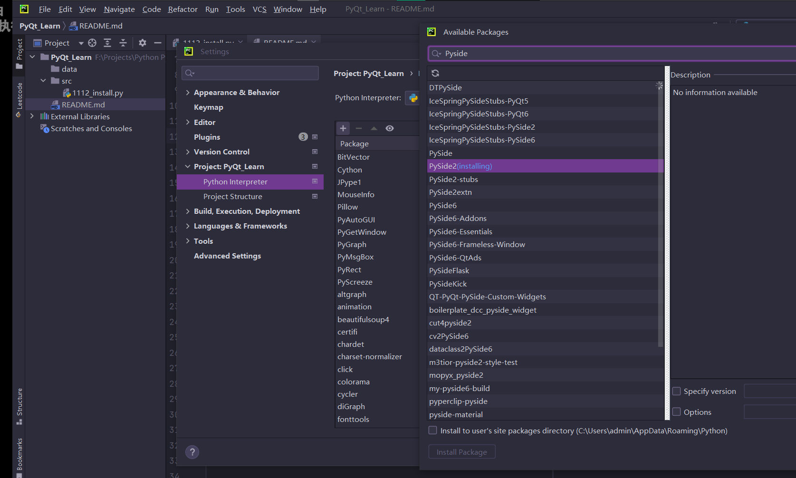
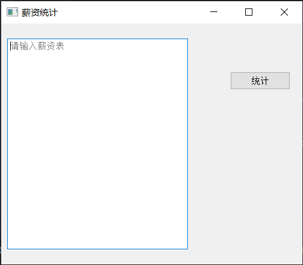
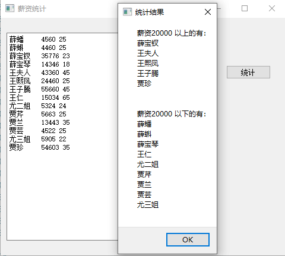

# ***PyQt 学习记录***

---

## ***学习资源***

[**B站视频链接 - Python Qt 图形界面编程 - PySide2 PyQt5 PyQt PySide**](https://www.bilibili.com/video/BV1cJ411R7bP/?p=2&spm_id_from=pageDriver&vd_source=0485bf51f6c5687165e39d63ac6bb095)

[**配套教程链接 - 白月黑羽 Qt图形界面**](https://www.byhy.net/tut/py/gui/qt_02/)

---
## ***2022-11-12 Day1***

### **PySide2、PyQt5 简介**

PySide2、PyQt5 都是基于著名的 Qt 库。Qt库里面有非常强大的图形界面开发库，但是Qt库是C++语言开发的，PySide2、PyQt5可以让我们通过Python语言使用Qt。

但是 PySide2、PyQt5 这两者有什么区别呢？

可以形象地这样说： PySide2 是Qt的 亲儿子 ， PyQt5 是Qt还没有亲儿子之前的收的 义子 （Riverbank Computing这个公司开发的）。

那为什么 PyQt5 这个义子 反而比 PySide2 这个亲儿子更出名呢？

原因很简单：PySide2 这亲儿子最近（2018年7月）才出生。 但是亲儿子毕竟是亲儿子，Qt准备大力培养，PySide2 或许更有前途。 已经在使用 PyQt5 的朋友不要皱眉， 两个库的使用 对程序员来说，差别很小：它们的调用接口几乎一模一样。

如果你的程序是PyQt5开发的，通常只要略作修改，比如把导入的名字从 PyQt5 换成 PySide2 就行了。反之亦然。

### **安装PySide2**

执行命令：

    pip install pyside2

pycharm 安装步骤：

### **实例测试**

现在我们要开发一个程序，让用户输入一段文本包含：员工姓名、薪资、年龄。

格式如下：

    薛蟠     4560 25
    薛蝌     4460 25
    薛宝钗   35776 23
    薛宝琴   14346 18
    王夫人   43360 45
    王熙凤   24460 25
    王子腾   55660 45
    王仁     15034 65
    尤二姐   5324 24
    贾芹     5663 25
    贾兰     13443 35
    贾芸     4522 25
    尤三姐   5905 22
    贾珍     54603 35

该程序可以把薪资在 2万 以上、以下的人员名单分别打印出来。

当然我们可以像以前一样，开发命令行程序（准确的说应该叫字符终端程序，因为UI是字符终端），让用户在字符终端输入。

但是如果我们能开发下面这样的图形界面程序，就更酷了

能吗？

能，用 Python Qt，开发上面的界面就只要下面这短短的程序即可

    from PySide2.QtWidgets import QApplication, QMainWindow, QPushButton,  QPlainTextEdit

    app = QApplication([])
    
    window = QMainWindow()  # 创建主窗口对象
    window.resize(500, 400)  # 窗口大小
    window.move(300, 310)  # 窗口位置
    window.setWindowTitle('薪资统计')  # 窗口名称
    
    textEdit = QPlainTextEdit(window)  # 文本编辑框
    textEdit.setPlaceholderText("请输入薪资表")  # 提示文本
    textEdit.move(10, 25)  # 编辑框位置
    textEdit.resize(300, 350)  # 编辑框大小
    
    button = QPushButton('统计', window)  # 按钮对象
    button.move(380, 80)  # 按钮位置
    
    window.show()  # 展现
    
    app.exec_()  # 事件处理循环

QApplication 提供了整个图形界面程序的底层管理功能，比如：

初始化、程序入口参数的处理，用户事件（对界面的点击、输入、拖拽）分发给各个对应的控件，等等…

对 QApplication 细节比较感兴趣的话，可以[点击这里参考官方网站](https://doc.qt.io/qt-5/qapplication.html)

既然QApplication要做如此重要的初始化操作，所以，我们必须在任何界面控件对象创建前，先创建它。

QMainWindow、QPlainTextEdit、QPushButton 是3个控件类，分别对应界面的主窗口、文本框、按钮

他们都是控件基类对象QWidget的子类。

要在界面上 创建一个控件 ，就需要在程序代码中 创建 这个 控件对应类 的一个 实例对象。

在 Qt 系统中，控件（widget）是 层层嵌套 的，除了最顶层的控件，其他的控件都有父控件。

QPlainTextEdit、QPushButton 实例化时，都有一个参数window，如下

    QPlainTextEdit(window)
    QPushButton('统计', window)

就是指定它的父控件对象 是 window 对应的QMainWindow 主窗口。

而 实例化 QMainWindow 主窗口时，却没有指定 父控件， 因为它就是最上层的控件了。

控件对象的 move 方法决定了这个控件显示的位置。

比如

window.move(300, 310) 就决定了 主窗口的 左上角坐标在 相对屏幕的左上角 的X横坐标300像素, Y纵坐标310像素这个位置。

textEdit.move(10,25) 就决定了文本框的 左上角坐标在 相对父窗口的左上角 的X横坐标10像素, Y纵坐标25像素这个位置。

控件对象的 resize 方法决定了这个控件显示的大小。

比如

window.resize(500, 400) 就决定了 主窗口的 宽度为500像素，高度为400像素。

textEdit.resize(300,350) 就决定了文本框的 宽度为300像素，高度为350像素。

放在主窗口的控件，要能全部显示在界面上， 必须加上下面这行代码

    window.show()

最后 ，通过下面这行代码

    app.exec_()

进入QApplication的事件处理循环，接收用户的输入事件（），并且分配给相应的对象去处理。

### **界面动作处理 (signal 和 slot)**

接下来，我们要实现具体的统计功能：

当用户点击 统计 按钮时， 从界面控件 QPlainTextEdit 里面获取 用户输入的字符串内容，进行处理。

首先第一个问题： 用户点击了 统计 按钮，怎么通知程序？ 因为只有程序被通知了这个点击，才能做出相应的处理。

在 Qt 系统中， 当界面上一个控件被操作时，比如 被点击、被输入文本、被鼠标拖拽等， 就会发出 信号 ，英文叫 signal 。就是表明一个事件（比如被点击、被输入文本）发生了。

我们可以预先在代码中指定 处理这个 signal 的函数，这个处理 signal 的函数 叫做 slot 。

比如，我们可以像下面这样定义一个函数

    def handleCalc():
        print('统计按钮被点击了')

然后， 指定 如果 发生了button 按钮被点击 的事情，需要让 handleCalc 来处理，像这样

    button.clicked.connect(handleCalc)

用QT的术语来解释上面这行代码，就是：把 button 被 点击（clicked） 的信号（signal）， 连接（connect）到了 handleCalc 这样的一个 slot上

大白话就是：让 handleCalc 来 处理 button 被 点击的操作。

但是上面这行代码运行后，只能在字符窗口 打印出 统计按钮被点击了 ， 还不能处理分析任务。

要处理分析任务，我们还得从 textEdit 对应的 文本框中 获取用户输入的文本，并且分析薪资范围，最终弹出对话框显示统计结果。

我们修改后，代码如下

    from PySide2.QtWidgets import QApplication, QMainWindow, QPushButton,  QPlainTextEdit,QMessageBox
    
    def handleCalc():
        info = textEdit.toPlainText()
    
        # 薪资20000 以上 和 以下 的人员名单
        salary_above_20k = ''
        salary_below_20k = ''
        for line in info.splitlines():
            if not line.strip():
                continue
            parts = line.split(' ')
            # 去掉列表中的空字符串内容
            parts = [p for p in parts if p]
            name,salary,age = parts
            if int(salary) >= 20000:
                salary_above_20k += name + '\n'
            else:
                salary_below_20k += name + '\n'
    
        QMessageBox.about(window,
                    '统计结果',
                    f'''薪资20000 以上的有：\n{salary_above_20k}
                    \n薪资20000 以下的有：\n{salary_below_20k}'''
                    )
    
    app = QApplication([])
    
    window = QMainWindow()
    window.resize(500, 400)
    window.move(300, 300)
    window.setWindowTitle('薪资统计')
    
    textEdit = QPlainTextEdit(window)
    textEdit.setPlaceholderText("请输入薪资表")
    textEdit.move(10,25)
    textEdit.resize(300,350)
    
    button = QPushButton('统计', window)
    button.move(380,80)
    button.clicked.connect(handleCalc)
    
    window.show()
    
    app.exec_()

运行后，你会发现结果如下

### **封装到类中**

上面的代码把控件对应的变量名全部作为全局变量。

如果要设计稍微复杂一些的程序，就会出现太多的控件对应的变量名。

而且这样也不利于 代码的模块化。

所以，我们通常应该把 一个窗口和其包含的控件，对应的代码 全部封装到类中，如下所示

    from PySide2.QtWidgets import QApplication, QMainWindow, QPushButton,  QPlainTextEdit,QMessageBox
    
    class Stats():
        def __init__(self):
            self.window = QMainWindow()
            self.window.resize(500, 400)
            self.window.move(300, 300)
            self.window.setWindowTitle('薪资统计')
    
            self.textEdit = QPlainTextEdit(self.window)
            self.textEdit.setPlaceholderText("请输入薪资表")
            self.textEdit.move(10, 25)
            self.textEdit.resize(300, 350)
    
            self.button = QPushButton('统计', self.window)
            self.button.move(380, 80)
    
            self.button.clicked.connect(self.handleCalc)
    
    
        def handleCalc(self):
            info = self.textEdit.toPlainText()
    
            # 薪资20000 以上 和 以下 的人员名单
            salary_above_20k = ''
            salary_below_20k = ''
            for line in info.splitlines():
                if not line.strip():
                    continue
                parts = line.split(' ')
                # 去掉列表中的空字符串内容
                parts = [p for p in parts if p]
                name,salary,age = parts
                if int(salary) >= 20000:
                    salary_above_20k += name + '\n'
                else:
                    salary_below_20k += name + '\n'
    
            QMessageBox.about(self.window,
                        '统计结果',
                        f'''薪资20000 以上的有：\n{salary_above_20k}
                        \n薪资20000 以下的有：\n{salary_below_20k}'''
                        )
    
    app = QApplication([])
    stats = Stats()
    stats.window.show()
    app.exec_()

这样代码的可读性是不是好多了？

### **Qt Designer 简介**

QT程序界面的 一个个窗口、控件，就是像上面那样用相应的代码创建出来的。

但是，把你的脑海里的界面，用代码直接写出来，是有些困难的。

很多时候，运行时呈现的样子，不是我们要的。我们经常还要修改代码调整界面上控件的位置，再运行预览。反复多次这样操作。

可是这样，真的…太麻烦了。

其实，我们可以用QT界面生成器 Qt Designer ，拖拖拽拽就可以直观的创建出程序大体的界面。

怎么运行这个工具呢？

Windows下，运行 Python安装目录下 Scripts\pyside2-designer.exe 这个可执行文件

如果你安装的是pyqt5， 运行 Python安装目录下 Scripts\pyqt5designer.exe 这个可执行文件

根据上面链接的视频讲解，大家初步了解一下 Qt Designer 的使用方法。

通过 Qt Designer 设计的界面，最终是保存在一个ui文件中的。

大家可以打开这个ui文件看看，就是一个XML格式的界面定义。

### **动态加载UI文件**

有了界面定义文件，我们的Python程序就可以从文件中加载UI定义，并且动态 创建一个相应的窗口对象。

如下：

    from PySide2.QtWidgets import QApplication, QMessageBox
    from PySide2.QtUiTools import QUiLoader
    
    class Stats:
    
        def __init__(self):
            # 从文件中加载UI定义
    
            # 从 UI 定义中动态 创建一个相应的窗口对象
            # 注意：里面的控件对象也成为窗口对象的属性了
            # 比如 self.ui.button , self.ui.textEdit
            self.ui = QUiLoader().load('main.ui')
    
            self.ui.button.clicked.connect(self.handleCalc)
    
        def handleCalc(self):
            info = self.ui.textEdit.toPlainText()
    
            salary_above_20k = ''
            salary_below_20k = ''
            for line in info.splitlines():
                if not line.strip():
                    continue
                parts = line.split(' ')
    
                parts = [p for p in parts if p]
                name,salary,age = parts
                if int(salary) >= 20000:
                    salary_above_20k += name + '\n'
                else:
                    salary_below_20k += name + '\n'
    
            QMessageBox.about(self.ui,
                        '统计结果',
                        f'''薪资20000 以上的有：\n{salary_above_20k}
                        \n薪资20000 以下的有：\n{salary_below_20k}'''
                        )
    
    app = QApplication([])
    stats = Stats()
    stats.ui.show()
    app.exec_()

如果你使用的是PyQt5 而不是 PySide2，加载UI文件的代码如下

    from PyQt5 import uic
    
    class Stats:
    
        def __init__(self):
            # 从文件中加载UI定义
            self.ui = uic.loadUi("main.ui")

### **转化UI文件为Python代码**

还有一种使用UI文件的方式：先把UI文件直接转化为包含界面定义的Python代码文件，然后在你的程序中使用定义界面的类

1. 执行如下的命令 把UI文件直接转化为包含界面定义的Python代码文件

    pyside2-uic main.ui > ui_main.py

如果你安装的是PyQt5，执行如下格式的命令转化

    pyuic5 main.ui > ui_main.py

然后在你的代码文件中这样使用定义界面的类

      from PySide2.QtWidgets import QApplication, QMessageBox
      from PySide2.QtUiTools import QUiLoader
      from PySide2.QtCore import QFile
      
      
      class Stats:
          def __init__(self):
              # 从文件中加载UI定义
              qfile_stats = QFile('../ui/stats.ui')
              qfile_stats.open(QFile.ReadOnly)
              qfile_stats.close()
      
              # 从 UI 定义中动态 创建一个相应的窗口对象
              # 注意：里面的控件对象也成为窗口对象的属性了
              # 比如 self.ui.button , self.ui.textEdit
              self.ui = QUiLoader().load(qfile_stats)
      
              self.ui.pushButton.clicked.connect(self.handleCalc)
      
          def handleCalc(self):
              info = self.ui.plainTextEdit.toPlainText()
      
              salary_above_20k = ''
              salary_below_20k = ''
              for line in info.splitlines():
                  if not line.strip():
                      continue
                  parts = line.split(' ')
      
                  parts = [p for p in parts if p]
                  name, salary, age = parts
                  if int(salary) >= 20000:
                      salary_above_20k += name + '\n'
                  else:
                      salary_below_20k += name + '\n'
      
              QMessageBox.about(self.ui,
                  '统计结果', f'''薪资20000 以上的有：\n{salary_above_20k}
                  \n薪资20000 以下的有：\n{salary_below_20k}''')
      
      
      # MAIN
      if __name__ == '__main__':
          app = QApplication([])
          stats = Stats()
          stats.ui.show()
          app.exec_()

那么我们该使用哪种方式比较好呢？动态加载还是转化为Python代码？

白月黑羽建议：通常采用动态加载比较方便，因为改动界面后，不需要转化，直接运行，特别方便。

但是，如果 你的程序里面有非qt designer提供的控件， 这时候，需要在代码里面加上一些额外的声明，而且 可能还会有奇怪的问题。往往就 要采用 转化Python代码的方法。

---
## ***2022-11-13 Day2***

---
## ***2022-11-14 Day3***

---
## ***2022-11-15 Day4***

---